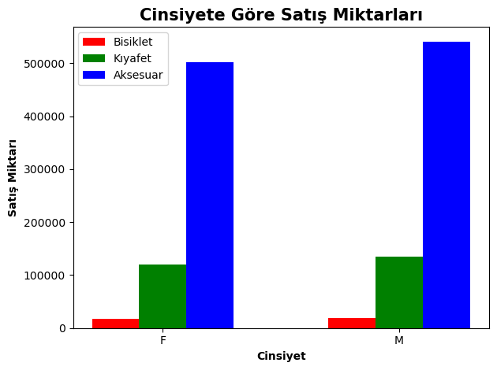

```python
import pandas as pd
import matplotlib.pyplot as plt
```


```python
data = pd.read_csv(r"C:\Users\ASUS\Documents\veri analizi 1\new_bike_sales.csv", sep=';') #veri setini okumak
```


```python
print(data)
```

                  Date  Day     Month  Year  Customer_Age       Age_Group  \
    0       26.11.2013   26  November  2013            19     Youth (<25)   
    1       26.11.2015   26  November  2015            19     Youth (<25)   
    2       23.03.2014   23     March  2014            49  Adults (35-64)   
    3       23.03.2016   23     March  2016            49  Adults (35-64)   
    4       15.05.2014   15       May  2014            47  Adults (35-64)   
    ...            ...  ...       ...   ...           ...             ...   
    113031  12.04.2016   12     April  2016            41  Adults (35-64)   
    113032   2.04.2014    2     April  2014            18     Youth (<25)   
    113033   2.04.2016    2     April  2016            18     Youth (<25)   
    113034   4.03.2014    4     March  2014            37  Adults (35-64)   
    113035   4.03.2016    4     March  2016            37  Adults (35-64)   
    
           Customer_Gender         Country             State Product_Category  \
    0                    M          Canada  British Columbia      Accessories   
    1                    M          Canada  British Columbia      Accessories   
    2                    M       Australia   New South Wales      Accessories   
    3                    M       Australia   New South Wales      Accessories   
    4                    F       Australia   New South Wales      Accessories   
    ...                ...             ...               ...              ...   
    113031               M  United Kingdom           England         Clothing   
    113032               M       Australia        Queensland         Clothing   
    113033               M       Australia        Queensland         Clothing   
    113034               F          France     Seine (Paris)         Clothing   
    113035               F          France     Seine (Paris)         Clothing   
    
           Sub_Category              Product  Order_Quantity  Unit_Cost  \
    0        Bike Racks  Hitch Rack - 4-Bike               8         45   
    1        Bike Racks  Hitch Rack - 4-Bike               8         45   
    2        Bike Racks  Hitch Rack - 4-Bike              23         45   
    3        Bike Racks  Hitch Rack - 4-Bike              20         45   
    4        Bike Racks  Hitch Rack - 4-Bike               4         45   
    ...             ...                  ...             ...        ...   
    113031        Vests      Classic Vest, S               3         24   
    113032        Vests      Classic Vest, M              22         24   
    113033        Vests      Classic Vest, M              22         24   
    113034        Vests      Classic Vest, L              24         24   
    113035        Vests      Classic Vest, L              23         24   
    
            Unit_Price  Profit  Cost  Revenue  
    0              120     600   360      960  
    1              120     600   360      960  
    2              120    1725  1035     2760  
    3              120    1500   900     2400  
    4              120     300   180      480  
    ...            ...     ...   ...      ...  
    113031          64     120    72      192  
    113032          64     880   528     1408  
    113033          64     880   528     1408  
    113034          64     960   576     1536  
    113035          64     920   552     1472  
    
    [112036 rows x 18 columns]
    


```python
print(data.isnull().sum()) #null değerlerin kategorilerine ayrılmış olarak toplamı
```

    Date                0
    Day                 0
    Month               0
    Year                0
    Customer_Age        0
    Age_Group           0
    Customer_Gender     0
    Country             0
    State               0
    Product_Category    0
    Sub_Category        0
    Product             0
    Order_Quantity      0
    Unit_Cost           0
    Unit_Price          0
    Profit              0
    Cost                0
    Revenue             0
    dtype: int64
    


```python
 data.drop_duplicates(inplace = True) #tekrar eden satırları silme
```


```python
order_quantity=data['Order_Quantity'].sum()  #satış miktarları toplamı
total_cost = data['Cost'].sum()  #maliyet toplamı
total_revenue=data['Revenue'].sum() #gelir toplamı
profit= data['Profit'].sum()  #net gelir toplamı
genders= data.groupby('Customer_Gender').sum() #cinsiyete göre tüm kategorilerin toplamı
```


```python
bike_sales = data[data['Product_Category'] == 'Bikes']  #bisiklet satışlarının ayrıştırılamsı
clothing_sales = data[data['Product_Category'] == 'Clothing']  #kıyafet satışlarının ayrıştırılması
accessories_sales = data[data['Product_Category'] == 'Accessories']  #aksesuar satışlarının ayrıştırılması
```


```python
t_bike_sales_by_gender = bike_sales.groupby('Customer_Gender')['Order_Quantity'].sum()  #toplam bisiklet satışları
t_clothing_sales_by_gender = clothing_sales.groupby('Customer_Gender')['Order_Quantity'].sum()  #toplam kıyafet satışları
t_accessories_sales_by_gender = accessories_sales.groupby('Customer_Gender')['Order_Quantity'].sum()  #toplam aksesuar satışları
```


```python
print(t_bike_sales_by_gender)
```

    Customer_Gender
    F    17939
    M    18262
    Name: Order_Quantity, dtype: int64
    


```python
print(t_clothing_sales_by_gender)
```

    Customer_Gender
    F    120588
    M    134125
    Name: Order_Quantity, dtype: int64
    


```python
print(t_accessories_sales_by_gender)
```

    Customer_Gender
    F    501431
    M    541360
    Name: Order_Quantity, dtype: int64
    


```python
fig, ax = plt.subplots()  # bar grafiği oluşturma

index = range(len(genders.index))  # Cinsiyet kategorilerini indekslemek
bar_width = 0.2  # Bar genişliği

# barların çizilmesi
plt.bar(index, t_bike_sales_by_gender, bar_width, color='r', label='Bisiklet')
plt.bar([i + bar_width for i in index], t_clothing_sales_by_gender, bar_width, color='g', label='Kıyafet')
plt.bar([i + 2 * bar_width for i in index], t_accessories_sales_by_gender, bar_width, color='b', label='Aksesuar')

plt.xlabel("Cinsiyet", fontweight ='bold', fontsize = 10)
plt.ylabel("Satış Miktarı", fontweight ='bold', fontsize = 10)
plt.title("Cinsiyete Göre Satış Miktarları", fontweight ='bold', fontsize = 15)
plt.xticks([i + bar_width for i in index], genders.index) # X ekseni etiketlerini ayarlar
plt.tight_layout()
plt.legend() # Grafikteki barların etiketlerini (label) gösterir
```


    <matplotlib.legend.Legend at 0x288dd328f40>


    

    

